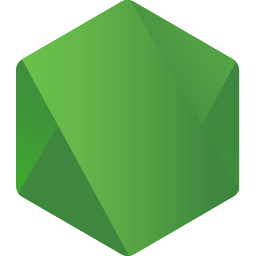
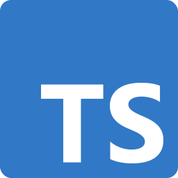
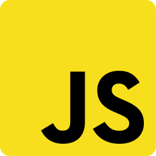

# Hello, welcome! 

 

### About me

- 💻 I'm web developer
- 📚 JavaScript | Node.js | TypeScript
- 🚀 I love to study
- 🎷 I love music and playing the saxophone
- 🎲 I love solving problems through technology

### Languages

  &nbsp;
  &nbsp;
  &nbsp;

 

---

 

<!--
**jordane-chaves/jordane-chaves** is a ✨ _special_ ✨ repository because its `README.md` (this file) appears on your GitHub profile.

Here are some ideas to get you started:

- 🔭 I’m currently working on ...
- 🌱 I’m currently learning ...
- 👯 I’m looking to collaborate on ...
- 🤔 I’m looking for help with ...
- 💬 Ask me about ...
- 📫 How to reach me: ...
- 😄 Pronouns: ...
- ⚡ Fun fact: ...
-->
